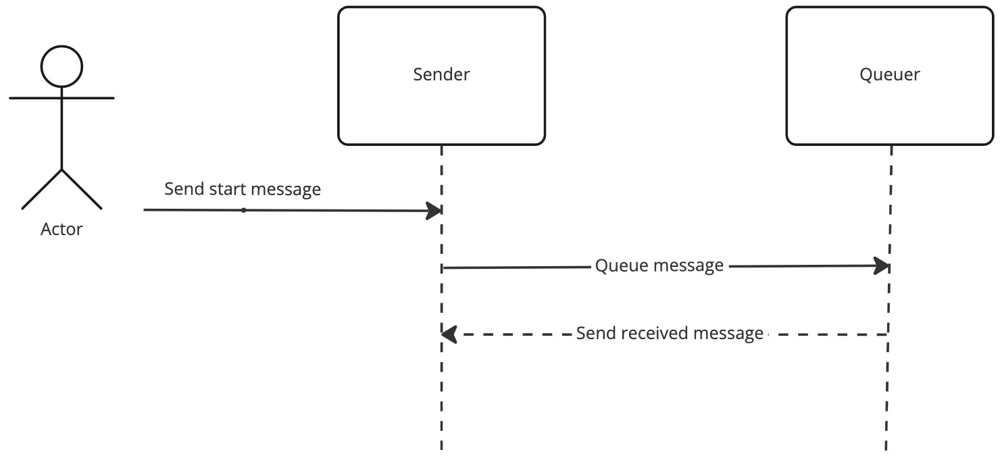

# Message Demo App

The Hosting Demo App demonstrates the use of Hydra4Net's SendMessage() functionality and the message queuing functionality, in combination with Microsoft.Extensions.Hosting wrappers.

The app supports functioning as a sender and queuer based on the settings in the appsettings.json file.

## DI configuration

Note the code used to register the necessary classes with DI:

```cSharp
var config = Configuration.GetSection("HydraConfig").GetHydraConfig();          
services
.AddHydraServices(config)
.AddHydraEventHandler<SampleMessageHandler>();
```
The `AddHydraEventHandler` method requires an implementation of the `IHydraEventsHandler` interface.  The abstract class `HydraEventsHandler` implements this for you, with the exception of the `OnMessageReceived` and `OnQueueMessageReceived` methods.

The library also handles Hydra queue management for you.


## Message Demo state diagram


Agent (us) sends the following message to `sender` to initiate the demo

```json
{
    "to":"sender-svcs:/",
    "frm": "external-client:/",
    "typ": "start",
    "bdy": {
        "cmd": "start"
    }
}
```

Upon receiving the above message `sender` queues the following message for the `queuer` service:

```json
{
    "to":"queuer-svcs:/",
    "frm": "sender-svcs:/",
    "typ": "queuer",
    "bdy": {
        "id": 1,
        "msg": "Sample job queue message"
    }
}
```

The `queuer` retrieves the message from its message queue, then processes the message and performs a send message back to the sender with the following message:

```json
{
    "to":"sender-svcs:/",
    "frm": "queuer-svcs:/",
    "typ": "complete",
    "bdy": {
        "id": 1,
        "msg": "Queuer: processed message containing Msg with ID of 1"
    }
}
```


---

## RAW Redis CLI commands
Using the Docker Desktop dashboard, open a terminal to the Redis container and connect to the Redis CLI from the terminal prompt.

```shell
redis-cli
```

or from windows terminal prompt (not the powershell) or Mac / Linux command shell:

Obtain the Redis docker container ID using `docker ps` and:

```sh
docker exec -it 5e596b786f4d redis-cli
```

### List PubSub channels
```
pubsub channels *sender*
```

### Subscribe to a channel
```
subscribe hydra:service:mc:sender-svcs, hydra:service:mc:sender-svcs:aaffcf1d2d974da39ef0fb6d65816047
```

### Send a message to a channel
```json
{
    "to":"sender-svcs:/",
    "frm": "external-client:/",
    "typ": "start",
    "bdy": {
        "cmd": "start"
    }
}
```

Above message has to be sent as an escaped JSON string

```
publish "hydra:service:mc:sender-svcs:aaffcf1d2d974da39ef0fb6d65816047" "{\"to\":\"sender-svcs:/\",\"frm\":\"external-client:/\",\"mid\":\"fe60ba9b-84ed-43be-90cd-a5f6eaa43f87\",\"ts\":\"2022-12-30T23:17:00.601Z\",\"typ\":\"start\",\"ver\":\"UMF/1.4.6\",\"via\":\"37528e822e70454cae2a2aa33643d791-1f7ljdkwrkz@hydra-router:/\",\"bdy\":{\"cmd\":\"start\"}}"
```

View queued items


```
lrange hydra:service:queuer-svcs:mqrecieved 0 99
```

## Startup Scripts
The `/scripts` folder contains scripts to start and stop a simple stack via docker compose to demonstrate the above funtionality.  

`start.ps1` will start the stack, including building the container for you; `stop.ps1` will bring it down.

