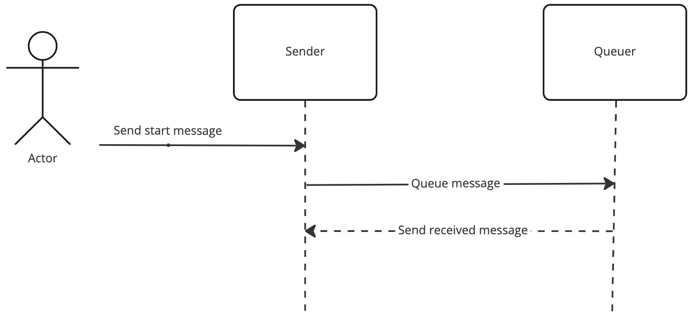

# Message Demo App

The Message Demo App demonstrates the use of Hydra4Net's SendMessage() functionality and the message queuing functionality.

The app support functioning as a sender and queuer based on the settings in the config.json file.

## Message Demo state diagram


## RAW Redis CLI comands
Using the Docker Desktop dashboard, open a terminal to the Redis container and connect to the Redis CLI from the terminal prompt.

```shell
redis-cli
```

or from windows terminal prompt (not the powershell) or Mac / Linux command shell:

Obtain the Redis docker container ID using `docker ps` and:

```sh
docker exec -it 5e596b786f4d redis-cli
```

### List PubSub channels
```
pubsub channels *sender*
```

### Subscribe to a channel
```
subscribe hydra:service:mc:sender-svcs, hydra:service:mc:sender-svcs:aaffcf1d2d974da39ef0fb6d65816047
```

### Send a message to a channel
```json
{
    "to":"sender-svcs:/",
    "frm": "external-client:/",
    "typ": "start",
    "bdy": {
        "cmd": "start"
    }
}
```

Above message has to be sent as an escaped JSON string

```
publish "hydra:service:mc:sender-svcs:aaffcf1d2d974da39ef0fb6d65816047" "{\"to\":\"sender-svcs:/\",\"frm\":\"external-client:/\",\"mid\":\"fe60ba9b-84ed-43be-90cd-a5f6eaa43f87\",\"ts\":\"2022-12-30T23:17:00.601Z\",\"typ\":\"start\",\"ver\":\"UMF/1.4.6\",\"via\":\"37528e822e70454cae2a2aa33643d791-1f7ljdkwrkz@hydra-router:/\",\"bdy\":{\"cmd\":\"start\"}}"
```

View queued items


```
lrange hydra:service:queuer-svcs:mqrecieved 0 99
```

